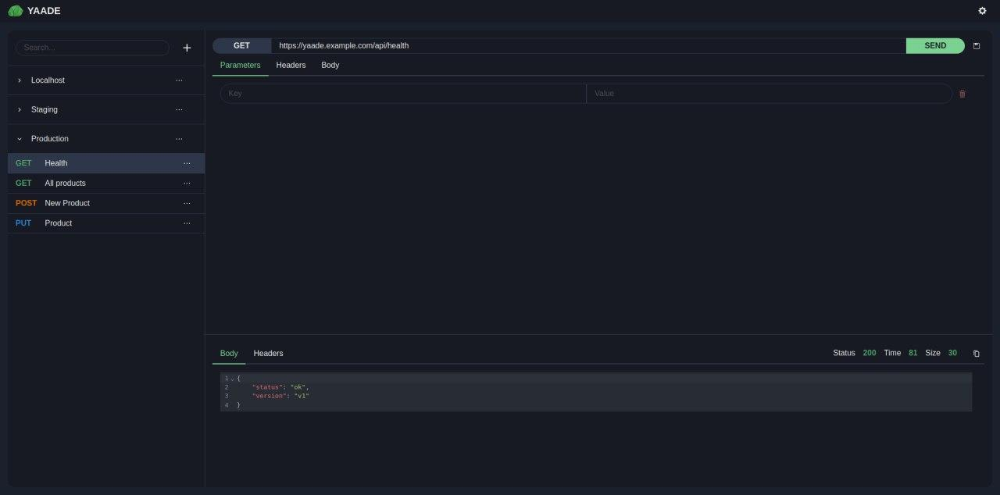
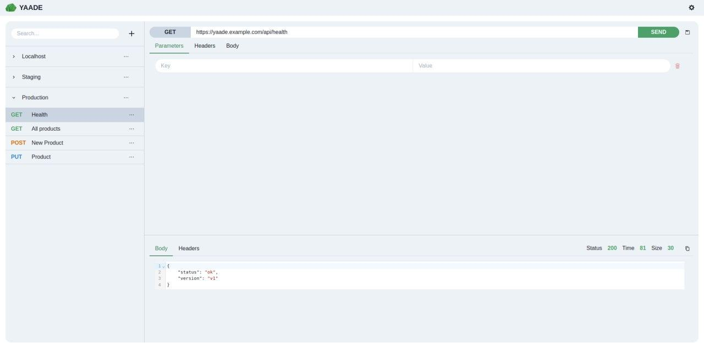

<p align="center">
    
</p>

<h1 align="center"><span style="color:#48bb78">Yaade</span> - Yet Another API Development Environment</h1>

Yaade is an open-source, self-hosted, collaborative API development environment.



## 🤔 Why did you develop Yaade?

I was looking for a self-hosted Postman alternative so that API collections can easily be shared between teammates. Even though popular solutions like <a href="https://hoppscotch.io/de/">Hoppscotch</a> exist, their self-hosted app does not come with authentication and relies on Firebase for persistency. Yaade is developed from the ground up with self-hosting and security in mind. That means sensitive information in API requests can safely be stored on your own server!

## 🌟 Features

1. Self-hosted: data never leaves your own server
2. Multi-user: manage users and their permissions
3. Persistent: even across container or server restarts
4. Easy single-file data import / export
5. Requests are executed on your machine so you can call localhost as well as remote servers
6. Most importantly: dark mode default

## ⚡ Install

To have the best experience with Yaade run the docker container on your server and install the browser extension on your local machine.

### 1. 🐋 Docker

```bash
docker volume create yaade
docker run -d --restart=always -p 9339:9339 -e YAADE_ADMIN_USERNAME=admin -v yaade:/app/data --name yaade esperotech/yaade:latest
```

The default password is `password`. After login go to ⚙️ > Account and change the password.

### 2. 🔧 Extension

Yaade uses a browser extension as a proxy to enable CORS requests. Install the extension using your browsers extension store. Currently only a chrome extension is available. You can find it <a href="https://chrome.google.com/webstore/detail/yaade-extension/mddoackclclnbkmofficmmepfnadolfa">here</a>. Then open it and input your server URL, eg. `https://yaade.example.com/`. From that point all requests originating from your Yaade browser tabs will be proxied through the extension.

## ⬆️ Upgrade

To upgrade the docker container with a new version, first stop the running container, pull the latest version and start a new container with the old volume.

```bash
docker rm -f yaade
docker pull esperotech/yaade:latest
docker run -d --restart=always -p 9339:9339 -e YAADE_ADMIN_USERNAME=admin -v yaade:/app/data --name yaade esperotech/yaade:latest
```

## 💾 Technology

1. SPA built with TypeScript, React and Vite.
2. Backend built with Kotlin.
3. H2 file-based database.
4. Browser extension with plain JavaScript.

## 🖥️ Local development

1. Install the required dependencies
    - Java 11
    - Kotlin
    - Node >= 16
2. Clone the repository
3. Install the project specific dependencies
```bash
cd scripts/
chmod +x install.sh
./install.sh
```
4. Start the server on port 9339 using your IDE of choice (I use IntelliJ IDEA)
    - you can also run it by using the jar file directly `$ java -jar server/build/libs/yaade-server-1.0-SNAPSHOT`
    - note that you must set the environment variable `YAADE_ADMIN_USERNAME` to run
5. Start the vite dev server on port 9338
```bash
cd client/
npm run dev
```
6. Start the dev-proxy on port 9337
```bash
cd dev-proxy/
node index.js
```
7. Now open your browser and visit http://localhost:9337

## 🔨 Build

```bash
cd scripts/
chmod +x build.sh
./build.sh
```

## Screenshots

### 🌙 Dark mode


### ☀️ Light mode



## 🤝  How can I contribute?

Your contribution is very welcome! First open an issue about the topic you want to contribute on, eg. adding a new feature, bugfixing or refactoring. We will then discuss further details. Eventually, I will review your Pull Request and merge / release it.